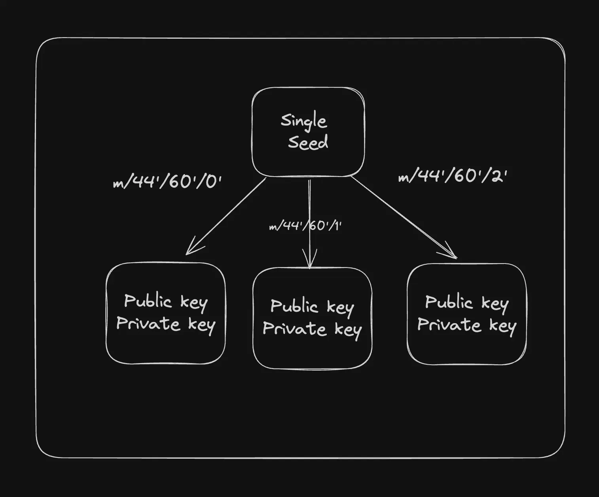

# WalletX - Multi-Chain HD Wallet Generator & Transaction Manager

A comprehensive React application for generating Hierarchical Deterministic (HD) wallets and managing transactions across Ethereum and Solana blockchains. Built with modern web technologies and industry-standard cryptographic methods.

- Link: https://walletx-one.vercel.app/



## 🚀 Features

### Core Wallet Functionality
- **Multi-Chain Support**: Generate wallets for both Ethereum and Solana
- **HD Wallet Generation**: Create multiple wallets from a single seed phrase
- **Seed Phrase Import**: Import existing wallets using 12/24-word seed phrases
- **Secure Key Management**: Industry-standard BIP-39/BIP-44 compliance
- **Cross-Platform Compatibility**: Works with MetaMask, Phantom, and other wallets

### Transaction Management
- **Send Transactions**: Transfer ETH and SOL with custom gas/fee settings
- **Network Support**: 
  - Ethereum: Mainnet & Sepolia Testnet
  - Solana: Mainnet & Devnet
- **Balance Tracking**: Real-time wallet balance updates
- **Transaction History**: View past transactions with blockchain explorers
- **Testnet Faucets**: Easy access to testnet tokens

### User Experience
- **Modern UI**: Clean, responsive design with TailwindCSS
- **Real-time Notifications**: Toast notifications for all operations
- **Secure Display**: Hide/show private keys and seed phrases
- **Copy to Clipboard**: Easy copying of addresses and keys
- **Network Switching**: Seamless switching between networks

## 🏗️ Technical Architecture

### Cryptographic Implementation

#### BIP-39 Mnemonic Generation
```javascript
// Generate cryptographically secure 12-word seed phrase
const mnemonic = generateMnemonic() // Uses crypto.getRandomValues()
// Example: "abandon ability able about above absent absorb abstract absurd abuse access accident"
```

#### BIP-44 Hierarchical Derivation
```javascript
// Ethereum derivation path: m/44'/60'/account'/0/address_index
const ethPath = `m/44'/60'/${accountIndex}'/0/0`

// Solana derivation path: m/44'/501'/account'/0'
const solPath = `m/44'/501'/${accountIndex}'/0'`
```

### Wallet Generation Logic

#### Ethereum Wallet Creation
```javascript
function createEthereumWallet(mnemonic, accountIndex = 0) {
  // 1. Generate/use mnemonic phrase (BIP-39)
  const seedPhrase = mnemonic || generateMnemonic()
  
  // 2. Create HD wallet using ethers.js
  const path = `m/44'/60'/${accountIndex}'/0/0`
  const derivedWallet = ethers.HDNodeWallet.fromPhrase(seedPhrase, path)
  
  // 3. Return wallet data
  return {
    seedPhrase,
    publicKey: derivedWallet.address,      // 0x... format
    privateKey: derivedWallet.privateKey,  // For transaction signing
    path
  }
}
```

#### Solana Wallet Creation
```javascript
function createSolanaWallet(mnemonic, accountIndex = 0) {
  // 1. Generate/use mnemonic phrase (BIP-39)
  const seedPhrase = mnemonic || generateMnemonic()
  
  // 2. Convert mnemonic to binary seed
  const seed = mnemonicToSeedSync(seedPhrase)
  
  // 3. Derive account-specific seed
  const accountSeed = new Uint8Array(32)
  for (let i = 0; i < 32; i++) {
    accountSeed[i] = seed[i] ^ (accountIndex & 0xFF)
  }
  
  // 4. Generate Ed25519 keypair
  const keypair = Keypair.fromSeed(accountSeed)
  
  return {
    seedPhrase,
    publicKey: keypair.publicKey.toBase58(), // Base58 format
    privateKey: Buffer.from(keypair.secretKey).toString('hex'),
    path: `m/44'/501'/${accountIndex}'/0'`
  }
}
```

### Transaction Processing

#### Ethereum Transaction Flow
```javascript
async function sendEthereumTransaction(walletData, recipient, amount) {
  // 1. Create wallet instance with provider
  const provider = new ethers.JsonRpcProvider(rpcUrl)
  const wallet = new ethers.Wallet(walletData.privateKey, provider)
  
  // 2. Get current gas price
  const gasPrice = await provider.getFeeData()
  
  // 3. Create transaction object
  const tx = {
    to: recipient,
    value: ethers.parseEther(amount),
    gasLimit: 21000,
    gasPrice: gasPrice.gasPrice
  }
  
  // 4. Sign and broadcast
  const txResponse = await wallet.sendTransaction(tx)
  const receipt = await txResponse.wait()
  
  return receipt
}
```

#### Solana Transaction Flow
```javascript
async function sendSolanaTransaction(walletData, recipient, amount) {
  // 1. Create keypair from private key
  const privateKeyBuffer = Buffer.from(walletData.privateKey, 'hex')
  const keypair = Keypair.fromSecretKey(privateKeyBuffer)
  
  // 2. Create connection
  const connection = new Connection(rpcUrl, 'confirmed')
  
  // 3. Create transfer instruction
  const transaction = new Transaction().add(
    SystemProgram.transfer({
      fromPubkey: keypair.publicKey,
      toPubkey: new PublicKey(recipient),
      lamports: Math.floor(amount * LAMPORTS_PER_SOL)
    })
  )
  
  // 4. Sign and send
  const signature = await connection.sendTransaction(transaction, [keypair])
  await connection.confirmTransaction(signature, 'confirmed')
  
  return signature
}
```

## 📦 Dependencies & Installation

### Prerequisites
- **Node.js**: Version 16 or higher
- **npm** or **yarn**: Package manager
- **Modern Browser**: Chrome, Firefox, Safari, Edge

### Core Dependencies

#### Blockchain Libraries
```json
{
  "@solana/web3.js": "^1.98.2",    // Solana blockchain interaction
  "ethers": "^6.15.0",             // Ethereum blockchain interaction
  "bip39": "^3.1.0",               // Mnemonic generation/validation
  "ed25519-hd-key": "^1.3.0",      // HD key derivation for Ed25519
  "tweetnacl": "^1.0.3"            // Cryptographic operations
}
```

#### Browser Polyfills
```json
{
  "buffer": "^6.0.3",              // Node.js Buffer polyfill
  "crypto-browserify": "^3.12.1",  // Node.js crypto polyfill
  "stream-browserify": "^3.0.0"    // Node.js stream polyfill
}
```

#### UI & Framework
```json
{
  "react": "^19.1.0",              // React framework
  "react-dom": "^19.1.0",          // React DOM rendering
  "react-router-dom": "^7.7.1",    // Client-side routing
  "react-hot-toast": "^2.5.2",     // Toast notifications
  "lucide-react": "^0.535.0",      // Icon library
  "tailwindcss": "^4.1.11"         // CSS framework
}
```

### Installation Steps

1. **Clone the repository**
```bash
git clone <repository-url>
cd walletx
```

2. **Install dependencies**
```bash
npm install
```

3. **Set up environment variables**
```bash
# Copy the example environment file
cp .env.example .env

# Edit .env with your RPC URLs
VITE_ETHEREUM_MAINNET_RPC_URL=your_ethereum_mainnet_url
VITE_ETHEREUM_SEPOLIA_RPC_URL=your_ethereum_sepolia_url
VITE_SOLANA_MAINNET_RPC_URL=your_solana_mainnet_url
VITE_SOLANA_DEVNET_RPC_URL=your_solana_devnet_url
```

4. **Start development server**
```bash
npm run dev
```

5. **Build for production**
```bash
npm run build
```

## 🔧 Configuration

### Vite Configuration
The project uses Vite with special configuration for blockchain libraries:

```javascript
// vite.config.js
export default defineConfig({
  plugins: [react(), tailwindcss()],
  define: {
    global: 'globalThis', // Global polyfill
  },
  resolve: {
    alias: {
      buffer: 'buffer',                    // Buffer polyfill
      crypto: 'crypto-browserify',         // Crypto polyfill
      stream: 'stream-browserify',         // Stream polyfill
    },
  },
  optimizeDeps: {
    include: ['buffer', 'crypto-browserify', 'stream-browserify'],
  },
})
```

### Environment Variables
```bash
# Ethereum RPC URLs
VITE_ETHEREUM_MAINNET_RPC_URL=https://eth-mainnet.g.alchemy.com/v2/YOUR_KEY
VITE_ETHEREUM_SEPOLIA_RPC_URL=https://eth-sepolia.g.alchemy.com/v2/YOUR_KEY

# Solana RPC URLs  
VITE_SOLANA_MAINNET_RPC_URL=https://solana-mainnet.g.alchemy.com/v2/YOUR_KEY
VITE_SOLANA_DEVNET_RPC_URL=https://solana-devnet.g.alchemy.com/v2/YOUR_KEY
```

## 🎯 Usage Guide

### 1. Generate New Wallet
```javascript
// Navigate to wallet page
// Select blockchain (Ethereum/Solana)
// Click "Generate Seed Phrase"
// Click "Add New Wallet" to create HD wallets
```

### 2. Import Existing Wallet
```javascript
// Select blockchain (Ethereum/Solana)
// Click "Import Seed Phrase"
// Enter your 12 or 24-word seed phrase
// Click "Import" to validate and import
// Generate wallets from imported seed
```

### 3. Send Transactions
```javascript
// Click "Send" button on any wallet
// Enter recipient address
// Enter amount to send
// Adjust gas/fee settings if needed
// Confirm transaction
```

### 4. Network Management
```javascript
// Use network dropdown to switch between:
// Ethereum: Mainnet ↔ Sepolia Testnet
// Solana: Mainnet ↔ Devnet
// Access testnet faucets for free tokens
```

## 🔐 Security Features

### Cryptographic Security
- **Secure Random Generation**: Uses `crypto.getRandomValues()` for entropy
- **BIP-39 Compliance**: Standard mnemonic generation and validation
- **BIP-44 Derivation**: Hierarchical deterministic key derivation
- **Ed25519 Signatures**: Solana's cryptographically secure signature scheme
- **ECDSA Signatures**: Ethereum's elliptic curve digital signatures

### Application Security
- **Client-Side Only**: Private keys never leave your browser
- **Local Storage**: Encrypted storage of wallet data
- **Input Validation**: Comprehensive validation of all inputs
- **Error Handling**: Graceful error handling prevents crashes
- **Network Isolation**: Separate handling of mainnet/testnet

### Best Practices
```javascript
// ✅ DO
- Store seed phrases offline and securely
- Use hardware wallets for large amounts
- Verify recipient addresses before sending
- Test on testnets before mainnet transactions
- Keep software updated

// ❌ DON'T
- Share private keys or seed phrases
- Use on public/shared computers
- Store large amounts in hot wallets
- Skip transaction confirmations
- Use weak or reused passwords
```

## 🌐 Blockchain Compatibility

### Ethereum Ecosystem
- **Networks**: Mainnet, Sepolia Testnet
- **Compatible Wallets**: MetaMask, Trust Wallet, Coinbase Wallet
- **Standards**: EIP-155 (Chain ID), EIP-1559 (Gas fees)
- **Token Support**: ETH, ERC-20 tokens (future update)

### Solana Ecosystem  
- **Networks**: Mainnet Beta, Devnet
- **Compatible Wallets**: Phantom, Solflare, Backpack
- **Standards**: SPL Token Standard
- **Token Support**: SOL, SPL tokens (future update)

### Cross-Chain Features
- **Unified Interface**: Same UI for both blockchains
- **Consistent UX**: Similar workflows across chains
- **Network Switching**: Easy switching between networks
- **Multi-Wallet**: Manage multiple wallets per blockchain

## 📁 Project Structure

```
walletx/
├── src/
│   ├── components/
│   │   ├── Wallet/
│   │   │   ├── Wallet.jsx          # Main wallet selector
│   │   │   ├── Ethereum.jsx        # Ethereum wallet generator
│   │   │   └── Solana.jsx          # Solana wallet generator
│   │   ├── Transactions/
│   │   │   ├── TransactionPage.jsx # Transaction router
│   │   │   ├── EthereumTransaction.jsx # ETH transactions
│   │   │   ├── SolanaTransaction.jsx   # SOL transactions
│   │   │   └── TransactionHistory.jsx  # Transaction history
│   │   ├── Layout.jsx              # App layout wrapper
│   │   ├── Navbar.jsx              # Navigation component
│   │   ├── Hero.jsx                # Landing page hero
│   │   └── Footer.jsx              # Footer component
│   ├── routes/
│   │   └── routes.jsx              # React Router configuration
│   ├── App.jsx                     # Main app component
│   ├── main.jsx                    # React entry point
│   └── index.css                   # Global styles
├── public/                         # Static assets
├── .env                           # Environment variables
├── vite.config.js                 # Vite configuration
├── package.json                   # Dependencies & scripts
└── README.md                      # This file
```

## 🚀 Development

### Available Scripts
```bash
npm run dev      # Start development server
npm run build    # Build for production
npm run preview  # Preview production build
npm run lint     # Run ESLint
```

### Development Workflow
1. **Setup**: Clone repo and install dependencies
2. **Environment**: Configure RPC URLs in `.env`
3. **Development**: Run `npm run dev` for hot reload
4. **Testing**: Test on testnets before mainnet
5. **Build**: Run `npm run build` for production

### Adding New Features
```javascript
// Example: Adding new blockchain support
1. Create new wallet component in src/components/Wallet/
2. Create new transaction component in src/components/Transactions/
3. Add blockchain selection in Wallet.jsx
4. Update routing in routes.jsx
5. Add RPC configuration in .env
```

## 🔮 Future Enhancements

### Planned Features
- **Token Support**: ERC-20 and SPL token transfers
- **NFT Management**: View and transfer NFTs
- **DeFi Integration**: Swap, stake, and yield farming
- **Hardware Wallet**: Ledger and Trezor support
- **Mobile App**: React Native mobile version
- **Multi-Language**: Internationalization support

### Technical Improvements
- **State Management**: Redux/Zustand for complex state
- **Testing**: Unit and integration tests
- **Performance**: Code splitting and lazy loading
- **PWA**: Progressive Web App features
- **Analytics**: Usage analytics and error tracking

## 🤝 Contributing

We welcome contributions! Please follow these steps:

1. **Fork** the repository
2. **Create** a feature branch (`git checkout -b feature/amazing-feature`)
3. **Commit** your changes (`git commit -m 'Add amazing feature'`)
4. **Push** to the branch (`git push origin feature/amazing-feature`)
5. **Open** a Pull Request

### Development Guidelines
- Follow existing code style and patterns
- Add comments for complex logic
- Test thoroughly on testnets
- Update documentation as needed
- Ensure security best practices

## 📄 License

This project is licensed under the MIT License - see the [LICENSE](LICENSE) file for details.

## ⚠️ Disclaimer

**Important Security Notice:**

- This software is provided "as is" without warranty
- Users are responsible for securing their private keys and seed phrases
- Never share private keys or seed phrases with anyone
- Test thoroughly on testnets before using mainnet
- Use hardware wallets for large amounts
- The developers are not responsible for any loss of funds

## 🙏 Acknowledgments

- **BIP-39/BIP-44**: Bitcoin Improvement Proposals for HD wallets
- **Ethereum Foundation**: For Ethereum blockchain and standards
- **Solana Labs**: For Solana blockchain and tools
- **Open Source Community**: For the amazing libraries and tools

## 📞 Support

- **Documentation**: Check this README and inline comments
- **Issues**: Report bugs via GitHub Issues
- **Discussions**: Join GitHub Discussions for questions
- **Security**: Report security issues privately

---

**Built with ❤️ by the WalletX Team**

*Empowering users with secure, decentralized wallet management across multiple blockchains.*