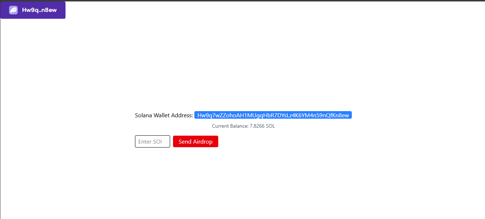

# Solana Airdrop DApp
Link : https://petal-estimate-4e9.notion.site/Wallet-adapter-860feade9cb940cea696eedf4fc61251

A React-based decentralized application (DApp) that allows users to connect their Solana wallet and request SOL airdrops on the Solana devnet.

## Features

- **Wallet Connection**: Connect any Solana-compatible wallet (Phantom, Solflare, etc.)
- **Balance Display**: Real-time SOL balance updates
- **Airdrop Functionality**: Request SOL tokens directly to your wallet
- **Rate Limiting**: Built-in protection against spam requests
- **Error Handling**: Comprehensive error messages for different failure scenarios

## Tech Stack

- **Frontend**: React 19.1.1 with Vite
- **Styling**: Tailwind CSS 4.1.12
- **Blockchain**: Solana Web3.js
- **Wallet Integration**: Solana Wallet Adapter

## Project Structure

```
src/
├── App.jsx              # Main application component with wallet providers
├── main.jsx            # Application entry point
├── index.css           # Global styles
└── components/
    └── Hero.jsx        # Main UI component for airdrop functionality
```

## Key Components

### App.jsx
The root component that sets up the Solana wallet infrastructure:
- **ConnectionProvider**: Connects to Solana devnet
- **WalletProvider**: Manages wallet state and connections
- **WalletModalProvider**: Provides wallet selection modal
- **WalletMultiButton**: Pre-built wallet connect/disconnect button

### Hero.jsx
The main interface component featuring:
- **Wallet Address Display**: Shows connected wallet's public key
- **Balance Tracking**: Real-time SOL balance updates using `useEffect`
- **Airdrop Form**: Input field for SOL amount (max 0.5 SOL)
- **Request Handling**: Manages airdrop requests with proper error handling
- **Rate Limiting**: Prevents spam requests with 2-second cooldown

## Installation

1. Clone the repository
2. Install dependencies:
```bash
npm install
```

## Dependencies

### Core Solana Packages
```bash
npm install @solana/wallet-adapter-base @solana/wallet-adapter-react @solana/wallet-adapter-react-ui @solana/wallet-adapter-wallets @solana/web3.js
```

### Styling
```bash
npm install tailwindcss @tailwindcss/vite
```

## Usage

1. Start the development server:
```bash
npm run dev
```

2. Open your browser and navigate to the local development URL

3. Click "Select Wallet" to connect your Solana wallet

4. Enter the amount of SOL you want to airdrop (maximum 0.5 SOL)

5. Click "Send Airdrop" to request tokens

## Network Configuration

The application is configured to use Solana's **devnet** for testing purposes:
- Endpoint: `https://api.devnet.solana.com`
- Devnet SOL has no real value and is used for development/testing

## Error Handling

The application handles various error scenarios:
- **Rate Limiting**: Prevents excessive airdrop requests
- **Insufficient Funds**: Alerts when wallet balance is too low
- **Network Errors**: Handles connection and transaction failures
- **Validation**: Ensures valid input amounts and wallet connection

## Development Scripts

- `npm run dev` - Start development server
- `npm run build` - Build for production
- `npm run preview` - Preview production build
- `npm run lint` - Run ESLint

## Security Features

- Input validation for airdrop amounts
- Rate limiting to prevent spam
- Proper transaction confirmation waiting
- Error boundary handling

## Reference

Based on Solana's official wallet adapter documentation:
https://solana.com/developers/cookbook/wallets/connect-wallet-react